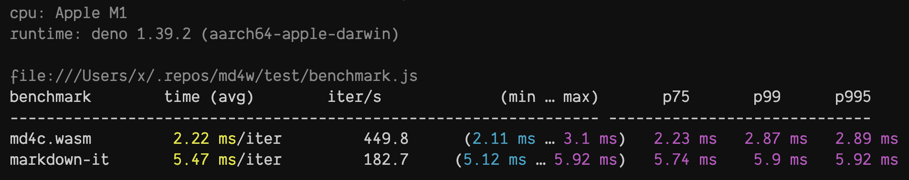

# md4w

A **Markdown** renderer written in Zig & C, compiled to **WebAssymbly** for all
JS runtimes.

- **Compliance**: powered by [md4c](https://github.com/mity/md4c) that is fully
  compliant to CommonMark 0.31, and partially supports GFM like task list,
  table, etc.
- **Fast**: written in Zig & C, compiled to WebAssembly (it's about **2.5x** faster
  than markdown-it, see [benchmark](#benchmark)).
- **Small**: `~28KB` gzipped.
- **Simple**: zero dependencies, easy to use.
- **Streaming**: supports web streaming API for large markdown files.
- **Universal**: works in any JavaScript runtime (Node.js, Deno, Bun, Browsers,
  Cloudflare Workers, etc).

## Usage

```js
// npm i md4w (Node.js, Bun, Cloudflare Workers, etc.)
import { init, mdToHtml, mdToJSON, mdToReadableHtml } from "md4w";
// or use the CDN url (Deno, Browsers)
import { init, mdToHtml, mdToJSON, mdToReadableHtml } from "https://esm.sh/md4w";

// waiting for md4w.wasm...
await init();

// markdown -> HTML
const html = mdToHtml("Stay _foolish_, stay **hungry**!");

// markdown -> HTML (ReadableStream)
const readable = mdToReadableHtml("Stay _foolish_, stay **hungry**!");
const response = new Response(readable, {
  headers: { "Content-Type": "text/html" },
});

// markdown -> JSON
const tree = mdToJSON("Stay _foolish_, stay **hungry**!");
```

## Wasm Mode

md4w provides two webassembly binary files:

- `md4w-fast.wasm`: Faster but larger binary file. (**270KB** gzipped)
- `md4w-small.wasm`: Tiny but slower binary file. (**28KB** gzipped)

By default, md4w uses the `md4w-fast.wasm` binary from file system, uses the `md4w-small.wasm` binary from CDN. You can also specify the wasm file by adding the `wasmMode` option.

```js
import { init } from "md4w";

await init("fast"); // or "small"
```

If you are using a **bundler** like vite, you need to configure the `wasm` input manually.

```js
import { init } from "md4w";
import wasmUrl from "md4w/js/md4w-fast.wasm?url";

await init(wasmUrl);
```

## Parse Flags

By default, md4w uses the following parse flags:

- `COLLAPSE_WHITESPACE`: Collapse non-trivial whitespace into single space.
- `PERMISSIVE_ATX_HEADERS`: Do not require space in ATX headers (`###header`).
- `PERMISSIVE_URL_AUTO_LINKS`: Recognize URLs as links.
- `STRIKETHROUGH`: Text enclosed in tilde marks, e.g. `~foo bar~`.
- `TABLES`: Support GitHub-style tables.
- `TASK_LISTS`: Support GitHub-style task lists.

You can use the `parseFlags` option to change the renderer behavior:

```ts
mdToHtml("Stay _foolish_, stay **hungry**!", {
  parseFlags: [
    "DEFAULT",
    "NO_HTML",
    "LATEX_MATH_SPANS",
    // ... other parse flags
  ],
});
```

All available parse flags are:

```ts
export enum ParseFlags {
  /** Collapse non-trivial whitespace into single space. */
  COLLAPSE_WHITESPACE,
  /** Do not require space in ATX headers ( ###header ) */
  PERMISSIVE_ATX_HEADERS,
  /** Recognize URLs as links. */
  PERMISSIVE_URL_AUTO_LINKS,
  /** Recognize e-mails as links.*/
  PERMISSIVE_EMAIL_AUTO_LINKS,
  /** Disable indented code blocks. (Only fenced code works.) */
  NO_INDENTED_CODE_BLOCKS,
  /** Disable raw HTML blocks. */
  NO_HTML_BLOCKS,
  /** Disable raw HTML (inline). */
  NO_HTML_SPANS,
  /** Support GitHub-style tables. */
  TABLES,
  /** Support strike-through spans (text enclosed in tilde marks, e.g. ~foo bar~). */
  STRIKETHROUGH,
  /** Support WWW autolinks (without proto; just 'www.') */
  PERMISSIVE_WWW_AUTO_LINKS,
  /** Support GitHub-style task lists. */
  TASKLISTS,
  /** Support LaTeX math spans ($...$) and LaTeX display math spans ($$...$$) are supported. (Note though that the HTML renderer outputs them verbatim in a custom tag <x-equation>.) */
  LATEX_MATH_SPANS,
  /** Support wiki-style links ([[link label]] and [[target article|link label]]) are supported. (Note that the HTML renderer outputs them in a custom tag <x-wikilink>.) */
  WIKI_LINKS,
  /** Denotes an underline instead of an ordinary emphasis or strong emphasis. */
  UNDERLINE,
  /** Using hard line breaks. */
  HARD_SOFT_BREAKS,
  /** Shorthand for NO_HTML_BLOCKS | NO_HTML_SPANS */
  NO_HTML,
  /** Default flags COLLAPSE_WHITESPACE | PERMISSIVE_ATX_HEADERS | PERMISSIVE_URL_AUTO_LINKS | STRIKETHROUGH | TABLES | TASK_LISTS */
  DEFAULT,
}
```

## Code Highlighter

md4w would not add colors to the code blocks by default, however, we provide a
`setCodeHighlighter` function to allow you to add any code highlighter you like.

```js
import { setCodeHighlighter } from "md4w";

setCodeHighlighter((code, lang) => {
  return `<pre><code class="language-${lang}">${hl(code)}</code></pre>`;
});
```

### Caveats

- The returned code will be inserted into the html directly, without html
  escaping. You should take care of the html escaping by yourself.
- Although we don't send back the highlighted code to the wasm module, the
  performance is still impacted by the code highlighter.

## Web Streaming API

md4w supports web streaming API for large markdown files, this also is useful
for a http server to stream the outputed html.

```js
import { mdToReadableHtml } from "md4w";

const readable = mdToReadableHtml(readFile("large.md"));

// write to file
const file = await Deno.open("/foo/bar.html", { write: true, create: true });
readable.pipeTo(file.writable);

// or send to browser
const response = new Response(readable, {
  headers: { "Content-Type": "text/html" },
});
```

### Buffer Size

By default, md4w uses a buffer size of `4KB` for streaming, you can change it by
adding the `bufferSize` option.

```js
mdToReadableHtml(largeMarkdown, {
  bufferSize: 16 * 1024,
});
```

### Caveats

The streaming API currently only uses the buffer for output, you still need
to load the whole markdown data into memory.

## Rendering to JSON

md4w also provides a `mdToJSON` function to render the markdown to JSON.

```js
const traverse = (node) => {
  // text node
  if (typeof node === "string") {
    console.log(node);
    return;
  }

  // element type
  console.log(node.type);

  // element attributes (may be undefined)
  console.log(node.props);

  // element children (may be undefined)
  node.children?.forEach(traverse);
};

const tree = mdToJSON("Stay _foolish_, stay **hungry**!");
traverse(tree);
```

### Node Type

The node type is a number that represents the type of the node. You can import
the `NodeType` enum to get the human-readable node type.

```ts
import { NodeType } from "md4w";

console.log(NodeType.P); // 9
console.log(NodeType.IMG); // 33

if (node.type === NodeType.IMG) {
  console.log("This is an image node, `src` is", node.props.src);
}
```

> All available node types are defined in the
> [`NodeType`](./js/md4w.d.ts#L76) enum.

## Development

The renderer is written in [Zig](https://ziglang.org/), ensure you have it (0.11.0)
installed.

```bash
zig build && deno test -A
```

## Benchmark



```bash
zig build && deno bench -A test/benchmark.js
```

## Prior Art

- [md4c](https://github.com/mity/md4c) - C Markdown parser. Fast. SAX-like
  interface. Compliant to CommonMark specification.
- [markdown-wasm](https://github.com/rsms/markdown-wasm) - Very fast Markdown
  parser and HTML generator implemented in WebAssembly, based on md4c.

## License

MIT
