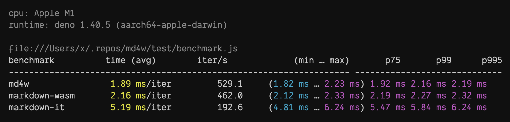

# md4w

A **Markdown-to-HTML** Parser written in Zig & C, compiled to WebAssymbly for
all JavaScript runtimes.

- **Fast**: written in Zig, powered by [md4c](https://github.com/mity/md4c),
  compiled to WebAssembly (it's about 2.5x faster than markdown-it, see
  [benchmark](#benchmark)).
- **Small**: `~25KB` gzipped.
- **Simple**: input markdown, output HTML.
- **Streaming**: supports streaming API for large markdown files.
- **Universal**: works in any JavaScript runtime (Node.js, Deno, Bun, Browsers,
  Cloudflare Workers, etc.).

## Usage

```js
// npm i md4w (Node.js, Bun, Cloudflare Workers, etc.)
import { init, mdToHtml, mdToReadableHtml } from "md4w";
// or use the CDN url (Deno, Browsers)
import { init, mdToHtml, mdToReadableHtml } from "https://esm.sh/md4w";

// waiting for md4w.wasm...
await init();

// markdown -> HTML
const html = mdToHtml("# Hello, World!");

// markdown -> HTML (ReadableStream)
const readable = mdToReadableHtml("# Hello, World!");
const response = new Response(readable, {
  headers: { "Content-Type": "text/html" },
});
```

## Parse Flags

By default, md4w uses the following parse flags:

- `COLLAPSE_WHITESPACE`: Collapse non-trivial whitespace into single space.
- `PERMISSIVE_ATX_HEADERS`: Do not require space in ATX headers (`###header`).
- `PERMISSIVE_URL_AUTO_LINKS`: Recognize URLs as links.
- `STRIKETHROUGH`: Text enclosed in tilde marks, e.g. `~foo bar~`
- `TABLES`: Support GitHub-style tables.
- `TASK_LISTS`: Support GitHub-style task lists.

You can use the `parseFlags` option to change the parser behavior:

```ts
mdToHtml("# Hello, World!", {
  parseFlags: {
    DEFAULT: true,
    NO_HTML: true,
    LATEX_MATHS_PANS: true,
    // ... other parse flags
  },
});
```

All available parse flags are:

```ts
const ParseFlags = {
  /** Collapse non-trivial whitespace into single space. */
  COLLAPSE_WHITESPACE: 0x0001,
  /** Do not require space in ATX headers ( ###header ) */
  PERMISSIVE_ATX_HEADERS: 0x0002,
  /** Recognize URLs as links. */
  PERMISSIVE_URL_AUTO_LINKS: 0x0004,
  /** Recognize e-mails as links.*/
  PERMISSIVE_EMAIL_AUTO_LINKS: 0x0008,
  /** Disable indented code blocks. (Only fenced code works.) */
  NO_INDENTED_CODE_BLOCKS: 0x0010,
  /** Disable raw HTML blocks. */
  NO_HTML_BLOCKS: 0x0020,
  /** Disable raw HTML (inline). */
  NO_HTML_SPANS: 0x0040,
  /** Support GitHub-style tables. */
  TABLES: 0x0100,
  /** Support strike-through spans (text enclosed in tilde marks, e.g. ~foo bar~). */
  STRIKE_THROUGH: 0x0200,
  /** Support WWW autolinks (without proto; just 'www.') */
  PERMISSIVE_WWW_AUTO_LINKS: 0x0400,
  /** Support GitHub-style task lists. */
  TASKLISTS: 0x0800,
  /** Support LaTeX math spans ($...$) and LaTeX display math spans ($$...$$) are supported. (Note though that the HTML renderer outputs them verbatim in a custom tag <x-equation>.) */
  LATEX_MATHS_PANS: 0x1000,
  /** Support wiki-style links ([[link label]] and [[target article|link label]]) are supported. (Note that the HTML renderer outputs them in a custom tag <x-wikilink>.) */
  WIKI_LINKS: 0x2000,
  /** Denotes an underline instead of an ordinary emphasis or strong emphasis. */
  UNDERLINE: 0x4000,
  /** Using hard line breaks. */
  HARD_SOFT_BREAKS: 0x8000,
  /** Shorthand for NO_HTML_BLOCKS | NO_HTML_SPANS */
  NO_HTML: 0x00200 | 0x0040,
  /** Default flags: COLLAPSE_WHITESPACE | PERMISSIVE_ATX_HEADERS | PERMISSIVE_URL_AUTO_LINKS | STRIKETHROUGH | TABLES | TASK_LISTS */
  DEFAULT: 0x0001 | 0x0002 | 0x0004 | 0x0100 | 0x0200 | 0x0800,
};
```

## Code Highlighter

md4w would not add colors to the code blocks by default, however, we provide a
`setCodeHighlighter` function to allow you to add any code highlighter you like.

```js
import { setCodeHighlighter } from "md4w";

setCodeHighlighter((code, lang) => {
  // return highlighted code in html
  return `<pre><code class="language-js"><span style="color:#green">...<span></code></pre>`;
});
```

> FYI: The output of the custom code highlighter would not be passed back to the
> wasm module, no need to worry about the performance.

## Streaming API

md4w supports streaming API for large markdown files, this also is useful for a
http servert to stream the response.

```js
import { mdToReadableHtml } from "md4w";

const largeMarkdown = `# Hello, World!\n`.repeat(1_000_000);
const readable = mdToReadableHtml(largeMarkdown);

// write to file
const file = await Deno.open("/foo/bar.html", { write: true, create: true });
readable.pipeTo(file.writable);

// or send to client
const response = new Response(readable, {
  headers: { "Content-Type": "text/html" },
});
```

### Buffer Size

By default, md4w uses a buffer size of `1KB` for streaming, you can change it by adding the `bufferSize` option:

```js
mdToReadableHtml(largeMarkdown, {
  bufferSize: 16 * 1024
});
```

### Caveats

The streaming API currently only uses the buffer for html output, you still need to load the raw markdown data into the memory.

## Development

The parser is written in [Zig](https://ziglang.org/), ensure you have it
installed. Also the [wasm-opt](https://github.com/WebAssembly/binaryen) is
required to optimize the generated WebAssembly binary.

```bash
zig build && deno test -A
```

## Benchmark



```bash
zig build && deno bench -A test/benchmark.js
```

## Prior Art

- [md4c](https://github.com/mity/md4c) - C Markdown parser. Fast. SAX-like
  interface. Compliant to CommonMark specification.
- [markdown-wasm](https://github.com/rsms/markdown-wasm) - Very fast Markdown
  parser and HTML generator implemented in WebAssembly, based on md4c.

## License

MIT
